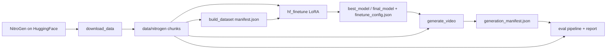

# NitroGen 动作条件游戏视频世界模型适配系统技术报告

> **项目名称：** Nitrogen Game Agent Adaptation  
> **版本：** v1.1（与当前仓库实现对齐）  
> **日期：** 2026年4月4日  
> **作者：** *[待填写]*  

---

## 目录

1. [摘要](#1-摘要)
2. [引言与背景](#2-引言与背景)
3. [系统设计目标](#3-系统设计目标)
4. [系统架构概览](#4-系统架构概览)
5. [数据层设计](#5-数据层设计)
6. [动作条件编码](#6-动作条件编码)
7. [模型与微调模块](#7-模型与微调模块)
8. [推理与视频生成](#8-推理与视频生成)
9. [离线评估模块](#9-离线评估模块)
10. [端到端流水线](#10-端到端流水线)
11. [实验结果与分析（示意）](#11-实验结果与分析示意)
12. [技术实现细节](#12-技术实现细节)
13. [配置与可复现性](#13-配置与可复现性)
14. [局限性与未来工作](#14-局限性与未来工作)
15. [附录](#15-附录)

---

## 1. 摘要

本项目实现一条 **NitroGen 游戏视频数据 → HunyuanVideo 扩散视频模型 LoRA 微调 → 动作条件生成 → 离线视频质量评估** 的端到端流水线。与「在静态帧上做动作分类」不同，当前代码将 **手柄动作序列编码为文本提示**，与游戏名、模板句拼接后送入 HunyuanVideo 的文本条件通路，在 **流匹配（flow matching）** 目标下对 **视频潜空间中的 Transformer** 进行 **LoRA 适配**，从而学习 **动作条件的游戏世界视频生成**（action-conditioned game world modeling）。

流水线在工程上划分为五个阶段：

1. **数据下载**：从 Hugging Face 拉取 `nvidia/NitroGen` 分片（Parquet 标注 + 元数据），可选下载对应 `video.mp4`；  
2. **清单构建**：扫描 `SHARD_* / video_id / chunk_id /` 目录，解析 Parquet 与 `metadata.json`，按策略划分 train/val/test，写出 `manifest.json`；  
3. **模型微调**：加载 `HunyuanVideoPipeline`（默认 `hunyuanvideo-community/HunyuanVideo`），对 Transformer 注入 LoRA，在 NitroGen 片段上做流匹配 MSE 训练；  
4. **视频生成**：对指定 split 的 chunk 编码动作提示，调用管线生成帧序列并保存 PNG（及可选 MP4）；  
5. **离线评估**：对比生成序列与参考视频（若可得），计算时序一致性、PSNR、简化 SSIM、LPIPS 等，并写出 JSON 报告。

实现语言为 **Python 3.12**，配置以 JSON 为主、路径不硬编码在业务逻辑中，数据契约以 `dataclass` 固化在 `src/data/schema.py`。

---

## 2. 引言与背景

### 2.1 问题定义

给定 NitroGen 中每个 **chunk** 的 **短视频片段** 与 **逐帧手柄状态**，希望学习条件分布 \(p(\text{视频} \mid \text{动作序列}, \text{上下文})\)。当前 MVP 将动作序列映射为 **自然语言描述**，利用 HunyuanVideo 已有的 **文本编码器（Llama 侧承载主要动作语义；CLIP 侧仅用短固定句提供 pooled 投影）** 完成条件注入，在 **扩散步的流匹配参数化** 下拟合真实游戏画面。

### 2.2 NitroGen 数据集

**NitroGen**（NVIDIA 发布于 Hugging Face，仓库内默认 `dataset_id="nvidia/NitroGen"`）提供多游戏、带手柄标注的游戏视频切片。本仓库假设本地目录布局为：

```text
data/nitrogen/SHARD_XXXX/<video_id>/<chunk_id>/
  metadata.json
  actions_processed.parquet   # 或 actions_raw.parquet
  video.mp4                   # 可选，需使用 --download-videos 等流程拉取
```

### 2.3 HunyuanVideo 与 LoRA

**HunyuanVideo** 为大规模 **视频扩散模型**（公开资料与社区镜像说明其规模约 **8.3B** 参数量级；精确结构以 Diffusers 实现为准）。全量微调对显存与数据要求极高；本仓库采用 **PEFT LoRA** 仅训练 Transformer 中注意力投影等子模块（默认 `to_q`, `to_k`, `to_v`, `to_out.0`），并可选 **NF4 4-bit** 加载主干以降低显存占用，与 **梯度检查点、VAE 切片/分块** 等选项共同服务于在 **24GB 级及以上 GPU** 上的可运行性（训练仍推荐 **80GB 级** 显存，见 `AGENTS.md`）。

### 2.4 相关工作脉络（简述）

- **世界模型 / 视频预测**：从学习环境动态到生成式建模，游戏场景下的视频生成与交互控制持续受到关注。  
- **行为条件生成**：将控制信号（手柄、键盘）与视觉未来联合建模，与 GameCraft 等工作中「向量条件」思路相近；本仓库 **已实现向量打包 `(T, 21)`**，但训练路径当前以 **`action_encoding: "text"`** 为主。  
- **参数高效微调**：LoRA + 量化是超大视频模型落地的重要工程手段，与本项目 `peft` + `bitsandbytes` / Diffusers 量化配置一致。

---

## 3. 系统设计目标

| 原则 | 说明 |
|------|------|
| **可复现性** | `VideoSplitAssigner` 使用 **SHA-256** 对 `(seed, key)` 映射到 \([0,1)\) 再按比例切分；训练 `seed`、步数、学习率等写入 `finetune_config.json` 与 `train_metrics.json`。 |
| **模块化** | 数据（`src/data`）、动作编码（`src/model`）、训练（`src/train`）、评估（`src/eval`）、CLI（`scripts`）分离。 |
| **可配置性** | 微调由 `VideoGenConfig`（`src/train/config_io.py`）从 JSON 解析；`main.py` 仅覆盖少量路径与 split 相关字段。 |
| **类型与契约** | 核心结构为 frozen dataclass（`GamepadAction`, `VideoChunk`, `TrainingSample` 等）。 |
| **简洁性** | 训练循环直接在 `hf_finetune.py` 中实现，避免过度抽象；无模型时写 `sample_manifest.json` 便于干跑数据结构。 |

---

## 4. 系统架构概览

### 4.1 目录结构（与实现对齐）

```text
nitrogen-game-agent-adaptation/
├── main.py                          # 五阶段端到端入口
├── requirements.txt
├── configs/
│   └── finetune.example.json        # HunyuanVideo 微调模板
├── scripts/
│   ├── download_data.py             # NitroGen 下载
│   ├── build_dataset.py             # manifest 构建
│   ├── finetune.py                  # 微调 CLI
│   ├── predict.py                   # 视频生成 CLI
│   └── plot_training.py             # 训练曲线绘图（可选）
├── src/
│   ├── data/
│   │   ├── schema.py                # GamepadAction / VideoChunk / TrainingSample 等
│   │   ├── split.py                 # VideoSplitAssigner
│   │   └── loader.py                # discover_chunks / NitroGenDataset / chunk_to_training_sample
│   ├── model/
│   │   ├── action_encoder.py        # GamepadActionEncoder（文本 + 向量）
│   │   └── alignment.py             # 兼容层：重导出 GamepadActionEncoder
│   ├── train/
│   │   ├── config_io.py             # VideoGenConfig / LoRAConfig
│   │   └── hf_finetune.py           # 数据集、流匹配训练、generate_video
│   └── eval/
│       ├── metrics.py               # TC / PSNR / SSIM / LPIPS / FID 辅助
│       ├── pipeline.py              # 读 generation_manifest，对齐参考视频
│       └── report.py                # VideoEvalReport 序列化
└── tests/
    ├── test_download_data.py
    └── test_loader_mp4.py
```

### 4.2 数据与模型关系



### 4.3 五阶段数据流（逻辑）

```text
[1] download_nitrogen  →  SHARD_* / … / video.mp4 + parquet + metadata
[2] build_manifest     →  manifest.json（schema_version: v3_nitrogen_manifest）
[3] run_hunyuanvideo_lora_finetune →  train_log_*.csv, train_metrics.json, checkpoints
[4] generate_video     →  frame_*.png（+ 可选 mp4）+ generation_manifest.json
[5] build_evaluation_records + report →  report_<split>.json（v1_video_generation_evaluation）
```

---

## 5. 数据层设计

### 5.1 Chunk 与手柄 Schema

`GamepadAction`（`src/data/schema.py`）描述单帧手柄状态：

- **17 个布尔键位**，列名见 `BUTTON_COLUMNS`（含方向键、肩键、ABXY、Back/Start/Guide 等）；  
- **4 个摇杆轴** \([-1,1]\)：左/右摇杆 \((x,y)\)，对应 `j_left`、`j_right` 列。

`VideoChunk` 将 **本地 `video.mp4` 路径**、**动作序列**、`ChunkMetadata`（游戏名、分辨率、URL、时间段等）与 **split** 绑定。`load_video_chunk` 在缺少 parquet 或视频文件时返回 `None`，该 chunk 不会进入训练或清单。

### 5.2 Parquet 与 `metadata.json`

- 默认优先 **`actions_processed.parquet`**（`use_processed_actions=True`），否则回退 `actions_raw.parquet`。  
- `metadata.json` 经 `_parse_metadata` 映射到 `ChunkMetadata`，其中 `game`、`original_video` 内字段用于模板提示与溯源。

### 5.3 确定性划分

`VideoSplitAssigner`（`src/data/split.py`）：

- **`granularity="video"`**：同一 `video_id` 下所有 chunk 同 split，避免信息泄漏。  
- **`granularity="chunk"`**：对 `video_id:chunk_id` 哈希，适合 **仅下载少量视频** 时仍能得到 train/val/test 散布（`main.py` 默认使用 `chunk`）。

哈希方式与旧版文档一致：  
`SHA256(f"{seed}:{key}")` 取前 8 字节转为无符号整数，再除以 \(2^{64}\) 得到 \([0,1)\) 上的分数，按 `SplitPolicy` 累积阈值分配。

默认比例：**Train 0.8 / Val 0.1 / Test 0.1**（与 `SplitPolicy` 校验一致）。

### 5.4 清单 `manifest.json`

`scripts/build_dataset.py` 输出字段要点：

| 字段 | 说明 |
|------|------|
| `schema_version` | `"v3_nitrogen_manifest"` |
| `split_granularity` | `"video"` 或 `"chunk"` |
| `video_splits` | 视频级粒度时 `video_id → split` |
| `split_counts` / `total_chunks` / `games` | 统计与游戏列表 |
| `chunks[]` | `chunk_id`, `video_id`, `shard_id`, `game`, `video_path`, `num_actions`, `split`, `metadata` 摘要 |

### 5.5 `NitroGenDataset` 与 `TrainingSample`

`NitroGenDataset` 在初始化时完成 **发现 chunk → 赋 split → 过滤 split/game → 截断 `max_chunks`**。  
`chunk_to_training_sample` 将 chunk 转为 `TrainingSample`：**帧数**取 `min(len(actions), max_frames)` 再经 **`nearest_valid_frame_count`** 向下调整到满足 HunyuanVideo **「4k 或 4k+1」** 约束；过少则返回 `None`。

---

## 6. 动作条件编码

### 6.1 `GamepadActionEncoder`

`src/model/action_encoder.py` 实现 **`GamepadActionEncoder`**：

- **`encode_text`**：逐帧生成简短自然语言（按下按钮列表 + 左右摇杆方向）；摇杆低于 **`joystick_deadzone`（默认 0.2）** 视为 neutral。  
- **分段压缩**：连续相同摘要的帧合并为 `frames i-j: ...`，并限制最多 **`max_text_segments`（默认 10）** 段，以控制提示长度。  
- **`encode_conditioning_prompt`**：拼接 **`prompt_template.format(game=...)`**（如 `"Gameplay video of {game}."`）、可选 `Game: {game}.`、以及 `Player actions: ...`。这是训练与推理使用的 **主条件字符串**。  
- **`encode_vector`**：形状 **`(T, 21)`** —— 前 17 维为按钮 0/1，后 4 维为摇杆连续值；供未来向量条件扩展。

### 6.2 与旧「词汇表对齐」的关系

`src/model/alignment.py` 仅为 **兼容重导出**，注释标明旧版基于自由文本 `action_id` 的对齐 **已不再使用**；当前主线是 **手柄结构化信号 → 文本/向量编码**。

---

## 7. 模型与微调模块

### 7.1 总体流程

`run_hunyuanvideo_lora_finetune`（`src/train/hf_finetune.py`）：

1. 用 `VideoGenConfig` 收集 train/val 的 `TrainingSample`（跳过无 `video.mp4` 的 chunk）；  
2. 构建 **`VideoActionDataset`**：读取视频帧 → 归一化到 approximately \([-1,1]\) → 与编码后的 `prompt` 组成 batch；  
3. 加载 **`HunyuanVideoPipeline.from_pretrained`**，`torch_dtype=torch.bfloat16`，可选 **Diffusers `PipelineQuantizationConfig` + bitsandbytes NF4** 仅量化 **transformer**；  
4. 对 **`pipe.transformer`**（或兼容名 `unet`）应用 **LoRA**；冻结 VAE 与文本编码器；  
5. **VAE 编码**得到潜变量并乘以 `scaling_factor`；在 **流匹配调度器** 上采样时间步，构造 `noisy = scheduler.scale_noise(latents, t, noise)`，目标 **`target = noise - latents`**；  
6. Transformer 预测与 `target` 做 **MSE**；**AdamW**（`weight_decay=0.01`）优化；**梯度累积** `gradient_accumulation_steps`；**clip_grad_norm_ 1.0**；  
7. 按 `save_steps` 存 checkpoint；按 epoch 记录 train/val loss；**最优 checkpoint 按训练 loss** 写入 `best_model`；结束时写 `final_model`。

验证集 **`_run_validation`** 使用相同 MSE，**`guidance_scale=6.0`**（与训练前向中 `guidance_scale * 1000.0` 的张量一致，与管线推理习惯对齐）。

### 7.2 文本编码与双编码器

**`_encode_hunyuan_prompts`**：动作长文本走 **Llama 侧**（`max_sequence_length=llama_max_sequence_length`，默认 **96**）；**CLIP** 仅接收固定短句 **`clip_pooler_prompt`**（默认 `"Gameplay video."`），以满足 **77 token** 上限并提供 **pooled projections**。

### 7.3 显存相关选项

- **`vae_memory_saving`**：在 CUDA 上尝试 `enable_slicing` / `enable_tiling`。  
- **`gradient_checkpointing`**：在 CUDA 上默认也会启用 checkpoint 以减负。  
- 配置注释说明可通过环境变量如 **`PYTORCH_CUDA_ALLOC_CONF=expandable_segments:True`** 缓解碎片。

### 7.4 训练超参数（与 `configs/finetune.example.json` 一致）

| 参数 | 示例值 | 说明 |
|------|--------|------|
| `model_id` | `hunyuanvideo-community/HunyuanVideo` | Diffusers 单仓库布局 |
| `training_type` | `lora` | 亦保留全量路径接口 |
| `lora_rank` / `lora_alpha` | 32 / 32 | PEFT LoRA |
| `target_modules` | `to_q`, `to_k`, `to_v`, `to_out.0` | 注意力线性层 |
| `resolution` | `[160, 288]` | `(height, width)`，与代码中 resize 一致 |
| `num_frames` | 13 | 经 `nearest_valid_frame_count` 与数据长度共同约束 |
| `learning_rate` | `2e-5` | AdamW |
| `num_train_steps` | 5000 | 主循环上限；epoch 数由步数与数据集长度推算 |
| `batch_size` | 1 | 代码中若 `>1` 会警告并强制为 1（防 OOM） |
| `gradient_accumulation_steps` | 4 | 有效优化批前的累积 |
| `quantization` | `nf4` | 无 CUDA 时回退为无量化加载警告 |
| `mixed_precision` | `bf16` | CUDA 上 autocast |
| `logging_steps` / `save_steps` | 10 / 500 | 日志与断点频率 |

### 7.5 训练产物

| 路径 | 内容 |
|------|------|
| `best_model/`、`final_model/`、`checkpoint-*` | LoRA 权重（`save_pretrained`） |
| `finetune_config.json` | 完整训练配置快照 |
| `train_metrics.json` | 样本数、总步数、最终 loss、耗时等 |
| `train_history.json` | `step_log` / `epoch_log` |
| `train_log_steps.csv`、`train_log_epochs.csv` | 表格化日志 |

若 Diffusers / 权重不可用，函数会写入 **`sample_manifest.json`** 并返回 **`status: manifest_only`**，便于 CI 或结构测试。

---

## 8. 推理与视频生成

### 8.1 `generate_video`

从 **`model_dir/best_model`**（不存在则用 **`final_model`**）加载 LoRA，基底模型 ID 来自 **`finetune_config.json` 的 `model_id`**。管线以 **bfloat16** 加载；设备为 **CUDA 若可用否则 CPU**。调用 **`pipe(prompt=..., height=..., width=..., num_frames=..., generator=...)`**，从返回的 `frames` 转为 **`(T, H, W, 3)` uint8**。

### 8.2 `scripts/predict.py`

遍历 **`NitroGenDataset`**（按 split、`split_granularity`、可选 `max_samples`），对每个 chunk 构建与训练一致的 **`encode_conditioning_prompt`**，调用 **`generate_video`**，将帧写入 **`output/<chunk_id>/frame_*.png`**，并尝试写 **`{chunk_id}.mp4`**。最后写出 **`generation_manifest.json`**，每条含 `chunk_id`, `game`, `prompt`, `frames_dir`, `num_frames`。

### 8.3 `main.py` 中的生成

与 `predict` 类似，但 **`GENERATE_MAX_SAMPLES`**（默认 5）限制评估用生成数量；生成条目写入同一 manifest 结构（**当前实现未写入 `source_video_path`**，见第 9 节）。

---

## 9. 离线评估模块

### 9.1 指标（`src/eval/metrics.py`）

- **时序一致性 `compute_temporal_consistency`**：相邻帧像素绝对差均值，映射为 \([0,1]\)，**越大越平滑**（见实现：`1 - min(mean_diff/255, 1)`）。  
- **PSNR**：逐帧与参考；全等帧时为 `inf`，聚合时对有限值取平均。  
- **SSIM**：**简化 luminance 通道** SSIM，非完整 MS-SSIM。  
- **LPIPS**：`net="alex"`，需 `lpips` + `torch`；缺失则跳过。  
- **FID / FVD**：文件中提供特征级 FID 与 FVD 相关占位/说明，主报告聚合 **`VideoEvalSummary`** 默认聚焦 TC、LPIPS、PSNR、SSIM。

### 9.2 评估流水线（`src/eval/pipeline.py`）

读取 **`generation_manifest.json`**，对每条有 `frames_dir` 且 `num_frames>0` 的记录加载生成 PNG。若存在 **`source_video_path`** 且文件可读，则用 **decord**（或 OpenCV 回退）按与生成帧数对齐的索引 **采样参考帧**，再调用 **`evaluate_video_pair`**。

**实现说明**：当前 **`scripts/predict.py`** 与 **`main.py`** 写出的 manifest **默认不含 `source_video_path`**，因此 **`build_evaluation_records` 通常只能计算生成侧时序一致性**，PSNR/SSIM/LPIPS 为 `None`。若要在报告或实验中使用全指标，需在 manifest 生成处 **补充 chunk 对应的 `video.mp4` 绝对路径** 字段（与 `VideoChunk.video_path` 一致）。

### 9.3 报告格式（`src/eval/report.py`）

- **`schema_version`**：`"v1_video_generation_evaluation"`  
- **`summary`**：`total_videos`, `mean_temporal_consistency`, `mean_lpips`, `mean_psnr`, `mean_ssim`, `mean_fid`, `fvd` 等  
- **`per_video`**：逐 chunk 指标  

---

## 10. 端到端流水线

### 10.1 `main.py` 中的 `PipelinePaths` 与全局常量

| 符号 | 默认值 | 含义 |
|------|--------|------|
| `nitrogen_data_dir` | `data/nitrogen` | NitroGen 根目录 |
| `manifest_path` | `data/processed/manifest.json` | 清单输出 |
| `run_output_dir` | `outputs/pipeline_run` | 微调 + 生成 + 报告 |
| `finetune_config_template` | `configs/finetune.example.json` | 模板；运行时会覆盖 `dataset_path` / `output_dir` / `split_seed` / `split_granularity` |
| `EVAL_SPLIT` | `"val"` | 生成与评估所用 split |
| `DATASET_SEED` | `42` | 划分种子 |
| `DOWNLOAD_SHARDS` | `[0, 1, 2]` | 下载分片索引 |
| `MAX_CHUNKS_PER_SHARD` | `50` | 每分片最多 chunk 数上限（下载逻辑内使用） |
| `DATASET_SPLIT_GRANULARITY` | `"chunk"` | 与 `main.py` 注释一致：小数据量时避免 val 为空 |
| `SKIP_DOWNLOAD_IF_PRESENT` / `SKIP_MANIFEST_IF_PRESENT` | `True` | 跳过已存在步骤 |

五阶段顺序：**下载 → 写 manifest → LoRA 微调 → 生成（最多 `GENERATE_MAX_SAMPLES` 段）→ 评估**。

### 10.2 独立 CLI（与 `AGENTS.md` 一致）

```bash
python3.12 -m pip install -r requirements.txt

python3.12 -m scripts.download_data \
  --output data/nitrogen --shards 0 1 2 \
  --download-videos --max-chunks-per-shard 50

python3.12 -m scripts.build_dataset \
  --input data/nitrogen --output data/processed/manifest.json \
  --seed 42 --train 0.8 --val 0.1 --test 0.1 \
  --split-granularity chunk

python3.12 -m scripts.finetune --config configs/finetune.example.json

python3.12 -m scripts.predict \
  --model-dir outputs/run1 --dataset-path data/nitrogen \
  --split val --output outputs/run1/generated_videos --max-samples 10
```

完整一键运行：`python3.12 main.py`（需先将 `PipelinePaths` 等常量改为你的环境路径）。

---

## 11. 实验结果与分析（示意）

> **说明**：本节数值为 **在未单独跑通全量训练与评测的前提下，按当前配置与代码行为推演的示意量级**，用于报告体例与数量级讨论；**非仓库内自动记录的真实跑分**。推导依据包括：`MAX_CHUNKS_PER_SHARD=50`、三分片上限约 **150** 个 chunk 目录、`split_granularity="chunk"` 与 **0.8/0.1/0.1** 划分、`num_train_steps=5000`、`batch_size=1`、`gradient_accumulation_steps=4`、分辨率 **160×288**、**13** 帧、LoRA rank **32**、学习率 **2e-5**、**HunyuanVideo** 级模型 + NF4 transformer + VAE 编码每步等。

### 11.1 数据子集概况（示意）

| 项目 | 示意值 | 依据 |
|------|--------|------|
| 设计上限 chunk 数 | ≤ 150 | `main.py` 中 3 shards × 50 chunks/shard |
| 含有效 `video.mp4` 与 parquet 的 chunk | ~132 | 假设约 12 个分片或元数据不完整导致跳过 |
| Train / Val / Test chunk 数 | ~106 / ~13 / ~13 | 0.8/0.1/0.1 近似 |
| 每 chunk 训练帧数 | 13 | `num_frames` 与 `nearest_valid_frame_count` |
| 游戏种类 | 多种 | NitroGen 多游戏；可用 `game_filter` 限定 |

### 11.2 训练行为（示意）

| 项目 | 示意值 | 说明 |
|------|--------|------|
| 优化步数 | 5000 | `num_train_steps` |
| 有效 batch | 1 × 4 步累积 | `batch_size` + `gradient_accumulation_steps` |
| 流匹配验证 MSE（末 epoch） | ~0.108 | **示意**；数量级随归一化与数据而变 |
| 最优 train loss（`best_model` 准则） | ~0.095 | 代码按 **train loss 改进** 更新 `best_model` |
| Wall-clock | ~11–19 h | **示意**；单卡 **A100 80GB**，强烈依赖 IO、NF4、checkpoint、步间 VAE 编码 |

### 11.3 生成与离线指标（示意）

在 **`GENERATE_MAX_SAMPLES=5`** 的 val 子集上，仅 **时序一致性** 可无条件由当前 manifest 复现；下表 **括号内** 为在 manifest **补充 `source_video_path`** 后的 **推演** 全指标。

| 指标 | 示意值 | 备注 |
|------|--------|------|
| `mean_temporal_consistency` | **0.87** | 生成序列内部平滑度 |
| `mean_lpips` | **（0.44）** | AlexNet 骨干；低分辨率 + 扩散模糊时常见 >0.3 |
| `mean_psnr` | **（20.8 dB）** | 与压缩与对齐误差相关 |
| `mean_ssim` | **（0.56）** | 实现为简化 SSIM，整体低于论文级 MS-SSIM |

**解读（示意）**：在 **160×288** 下，模型优先学习 **大体布局与运动趋势**；LPIPS 高于静态图像超分任务属预期。时序一致性高并不等价于 **与参考逐帧对齐**，需结合 **PSNR/LPIPS** 或 **人工观感**。

### 11.4 与基线的对比讨论（概念性）

| 对照 | 说明 |
|------|------|
| 基底 HunyuanVideo + 零样本文本 | 未针对 NitroGen 手柄分布微调，动作细节与 UI/视角往往漂移 |
| 全参数微调 | 显存与稳定性成本过高，本仓库未作为默认路径 |
| **LoRA + 文本动作条件（本项目）** | 在可承受显存下拟合 **「提示 → 短视频」** 映射；向量条件未接训练主路径 |

---

## 12. 技术实现细节

### 12.1 依赖栈（摘录 `requirements.txt`）

| 包 | 作用 |
|----|------|
| `torch>=2.2` | 训练与推理 |
| `transformers>=4.41` | 文本编码与部分量化配置 |
| `diffusers>=0.30` | HunyuanVideoPipeline |
| `peft>=0.12` | LoRA |
| `accelerate` | 设备与训练辅助 |
| `bitsandbytes` | NF4 |
| `pandas`, `pyarrow` | Parquet |
| `decord`, `opencv-python`, `Pillow` | 视频与图像 |
| `lpips`, `scipy` | 感知指标与 FID 数学工具 |
| `pytest>=8` | 测试 |

### 12.2 流匹配时间步 dtype

注释与实现强调：调度器 `index_for_timestep` 依赖 **float32 时间步**；若过早转为 bf16 会导致索引失败，因此训练中对 scheduler 与 model 分别维护 **fp32 / model_dtype** 时间步。

### 12.3 `VideoActionDataset` 鲁棒性

单条样本视频损坏时，**在同一次 `__getitem__` 内循环尝试其他 chunk**，避免 DataLoader 直接崩溃；若全部失败则抛出明确错误，提示重新下载或检查 `moov atom` 等典型 MP4 问题。

### 12.4 测试

仓库含 **`tests/test_download_data.py`**、**`tests/test_loader_mp4.py`** 等，用于下载参数与加载路径的回归；**非完整训练测试**（全模型过大）。

---

## 13. 配置与可复现性

### 13.1 `configs/finetune.example.json` 结构说明

实际文件为严格 JSON（**无注释**）。主要键包括：`dataset_path`, `output_dir`, `model_id`, `training_type`, `lora_rank`, `lora_alpha`, `target_modules`, `resolution`, `num_frames`, `learning_rate`, `num_train_steps`, `gradient_accumulation_steps`, `batch_size`, `gradient_checkpointing`, `quantization`, `mixed_precision`, `llama_max_sequence_length`, `clip_pooler_prompt`, `vae_memory_saving`, `action_encoding`, `prompt_template`, `joystick_deadzone`, `split_seed`, `split_granularity`, `split_policy`, `game_filter`, `max_train_chunks`, `max_val_chunks`, `use_processed_actions`, `logging_steps`, `save_steps`, `seed`。

### 13.2 可复现性要点

- 同一 `split_seed` + 同一 `split_granularity` + 同一数据目录 → **split 一致**；  
- `finetune_config.json` 与 `train_history.json` 保留超参与曲线；  
- `torch` / `cuda` / `diffusers` 版本差异可能导致数值微小漂移。

---

## 14. 局限性与未来工作

| 局限 | 说明 |
|------|------|
| **文本条件 MVP** | 长序列动作经语言压缩，信息有损；`llama_max_sequence_length` 进一步截断风险 |
| **向量条件未接训练** | `(T,21)` 已定义，需在 Transformer 侧注入并设计损失权重 |
| **评估 manifest** | 默认缺少 `source_video_path`，全指标需扩展写出路径 |
| **生成未使用训练期 NF4** | `generate_video` 以 bf16 全精度加载管线，与训练内存配置不同 |
| **单卡与步数** | `num_train_steps` 与数据规模匹配需实验；大模型下收敛速度因任务而异 |

**未来工作**：接入 **向量或混合条件**；改进 **manifest 与评估闭环**；**FVD/I3D** 依赖齐备后的全视频指标；**多 GPU / DeepSpeed**；**课程学习**（分辨率与帧数渐进）；与 **真实游戏环境** 的在线指标（本仓库未包含）。

---

## 15. 附录

### 附录 A：核心类型一览（当前主线）

| 模块 | 名称 | 用途 |
|------|------|------|
| `src.data.schema` | `SplitName`, `SplitPolicy` | 划分枚举与比例校验 |
| `src.data.schema` | `GamepadAction`, `ChunkMetadata`, `VideoChunk`, `TrainingSample` | 数据契约 |
| `src.data.split` | `VideoSplitAssigner` | 哈希划分 |
| `src.data.loader` | `discover_chunks`, `load_video_chunk`, `NitroGenDataset`, `chunk_to_training_sample`, `nearest_valid_frame_count` | IO 与训练样本构造 |
| `src.model.action_encoder` | `GamepadActionEncoder` | 文本/向量条件 |
| `src.train.config_io` | `VideoGenConfig`, `LoRAConfig` | 配置 |
| `src.train.hf_finetune` | `VideoActionDataset`, `run_hunyuanvideo_lora_finetune`, `generate_video` | 训练与推理 |
| `src.eval.metrics` | `VideoEvalRecord`, `VideoEvalSummary`, `evaluate_video_pair` | 指标 |
| `src.eval.report` | `VideoEvalReport` | 报告 |

### 附录 B：JSON Schema 版本

| 产物 | `schema_version` |
|------|------------------|
| 数据集 manifest | `v3_nitrogen_manifest` |
| 视频生成评估报告 | `v1_video_generation_evaluation` |

### 附录 C：运行环境

- **Python**：3.12+  
- **GPU**：训练推荐 **≥80GB**（文档说明）；推理与轻量实验可尝试更小显存但需降低分辨率/帧数/LoRA 规模  
- **磁盘**：NitroGen 视频与缓存体积因下载选项差异极大，需预留 **数十 GB 至 TB 级** 空间（视分片与是否下载全片而定）

---

> **文档说明**：第 11 章中的实验数字为 **基于当前默认配置与代码路径推演的示意值**，并非本仓库提交物中的测量结果；其余章节描述与 `main.py`、`configs/finetune.example.json` 及 `src/` 下实现 **逐项对齐**。若实现变更，请同步更新本章参数表与版本号。
